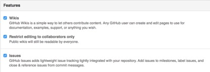

---
layout:post
date:2015-12-13 15:30
title:"从零开始搭建属于自己的blog"
author:"Lemon Yang"

---
##为什么要搭建自己的博客##
从很早开始，就想着拥有一个自己的博客，因为感觉这是一件很cool的事情，仿佛是在网络上拥有自己的一个家一样。

而自己搭建一个博客，除了比较折腾之外，却给了自己很大的定制自由度，而且也能给自己带来更多的挑战和成就感。

在开始搭建这个博客之前，自己想过各种方案，包括自己实现一个包含前后端的动态页面，后来发现这个方案对自己难度有点大(毕竟自己学习的是安卓开发，前后端的知识只是略知皮毛而已)。后来逛知乎的时候无意中看到了这一篇文章
>[如何搭建一个独立博客](http://cnfeat.com/blog/2014/05/10/how-to-build-a-blog/)

于是就果断开始了自己的自搭博客之旅。

这篇博文也是在按照上面提及到的那篇文章实践之后，自己的整理回顾。

##开始搭建自己的博客##
我选用的搭建自己的个人博客的方案就是
>独立域名+GitHub Pages+jekyll

###1.购买域名###
对于购买域名要注意什么情况，我不是很清楚，因为我是直接找了度娘要去哪里买域名的，后来选择了[新网](www.xinnet.com)和[西部数码](www.west.cn)，这个博客的域名就是在西部数码买的，购买过程中，并没有感觉到有什么不一样😅
###2.注册GitHub###
跟普通的网站注册并没有什么区别，只不过有时候在国内的网络环境我会出现访问不了[Github](https://github.com)的情况，所以有可能会需要到墙外去才可以。
###3.搭建本地git操作环境###
因为这篇博文主要介绍搭建博客的内容，所以具体怎么在自己电脑上面搭建git的操作环境，这里不再详细介绍，我在这里给大家推荐几篇博文：
>[git历险记 git安装与配置](
http://www.infoq.com/cn/news/2011/01/git-adventures-install-config)

git作为一个版本控制系统，里面包含的学问可是非常大的，如果你还会使用git进行项目的版本控制，可以去看一下这篇博文
>[git简易教程 廖雪峰](http://www.liaoxuefeng.com/wiki/0013739516305929606dd18361248578c67b8067c8c017b000)

###4.开始使用GitHub Pages###
当我们访问[GitHub Pages](https://pages.github.com)时候，上面就有教我们怎么开始创建自己的静态页面blog。其实也是新建一个repository,但是跟我们平时的项目的repository有两个不一样的地方:

*   一个GitHub账号只能创建一个这样的repository，从图片我们看出两种repository不同的地方

*   这个repository的命名必须是username.github.io(username就是你注册的GitHub帐户名)

+ ####绑定自己的独立域名#####

	在我们创建了作为存放我们的博客的repository之后，我们可以现在把我们一开始购买的域名解析到我们的Github pages上面来

	1. 在我们的repository根目录下添加一个名为CNAME的文件，文件内容就是我们的域名地址，例如我的就是“gdut-lemon.cc”
	2. 使用[DNS pod](https://www.dnspod.cn)对我们的域名进行解析（相对我们够买的域名的所在官网做解析，这一个可以提供更多额外的选项）,具体的操作方法可以参考这篇文章
>[dnspod域名解析设置](http://jingyan.baidu.com/article/6181c3e04b5f2e152ef15321.html)

	至此我们就完成了绑定自己的独立域名的这个环节。
	
+ ####使用Jekyll创建精美的博客页面####
	jekyll可以帮助我们将纯文本的内容转化成静态的网站和博客，通过使用markdown或者是html等标记语言，就能够完成文本的展示，并且jekyll提供了及其丰富的主题，能够让我们的博客具备更加新颖的外观。
	
	关于jekyll的用法，我们可以在官方的文档的帮助下完成：
	>[jekyll  中文帮助文档](http://jekyll.bootcss.com)
	
	当我们使用jekyll的时候，一般至少要包含如下的文件：
	* _config.yml  保存配置数据
	* _includes 加载里面的文件到布局或者文章中以方便重用
	* _layouts layouts 是包裹在文章外部的模板
	* _posts 存放我们的文章。文件格式很重要，必须要符合:  
	> YEAR-MONTH-DAY-title.MARKUP。
	
	具体的使用方法和解释说明可以阅读上面的帮助文档
	
	我们可以使用相应的主题美化我们的博客页面，更多的主题我们可以在网站上看到：
	>[jekyll  themes](http://jekyllthemes.org)
	
通过以上的步骤就已经完成了我们自己的博客搭建的所有工作了，你也可以fork我的[Github项目](https://github.com/lemon-yang/lemon-yang.github.io.git)作为参考。我的博客主页也是参考了[黄玄的主页](https://github.com/Huxpro/huxpro.github.io.git)进行修改的。

